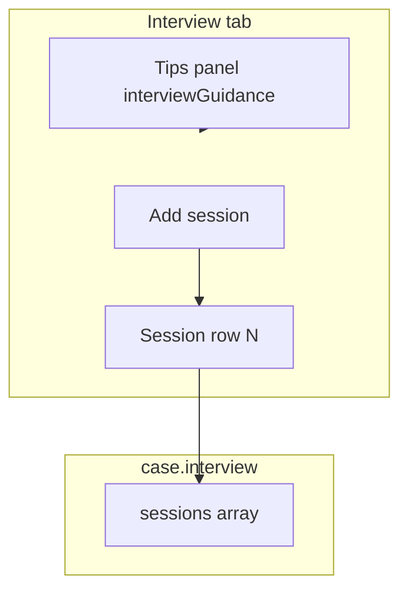

# خطة: القائمة الرئيسية، الدولة، الأدلة، ومقابلات متعددة

## 1) إزالة مرجع التقييم من الصفحة الرئيسية

- حذف كتلة `
` بالكامل من `[cases.html](h:/NEZAMERP/Customers/sameh/ninja-GRC-webapp/ninja_grc_app/cases.html)` و `[partials/view-list.html](h:/NEZAMERP/Customers/sameh/ninja-GRC-webapp/ninja_grc_app/partials/view-list.html)`.
- في `[js/app.js](h:/NEZAMERP/Customers/sameh/ninja-GRC-webapp/ninja_grc_app/js/app.js)`: إزالة أي إسناد لـ `scoringRefInlineSummary` (والتحقق من عدم وجود مراجع أخرى لـ `scoringRefInline`).

---

## 2) حذف حقل «أدلة إضافية» من صفوف الأدلة

- إزالة `evidenceItemsList` من المصفوفة `EVIDENCE_ROW_KEYS` والقالب في `[cases.html](h:/NEZAMERP/Customers/sameh/ninja-GRC-webapp/ninja_grc_app/cases.html)` / `[partials/view-form.html](h:/NEZAMERP/Customers/sameh/ninja-GRC-webapp/ninja_grc_app/partials/view-form.html)` (حقل الـ textarea داخل `#evidenceRecordTpl`).
- في `[js/forms.js](h:/NEZAMERP/Customers/sameh/ninja-GRC-webapp/ninja_grc_app/js/forms.js)`: تعديل `collect`/`fill`/`emptyEvidenceRecord` ومسار التراجع عند غياب القالب.
- في `[js/print-view.js](h:/NEZAMERP/Customers/sameh/ninja-GRC-webapp/ninja_grc_app/js/print-view.js)`: عدم طباعة صف `evidenceItemsList` (البيانات القديمة في JSON تبقى دون عرض إن رغبت، أو تُهمل).
- تنظيف اختياري: مفتاح `evidenceItemsList` في `[data/translations.json](h:/NEZAMERP/Customers/sameh/ninja-GRC-webapp/ninja_grc_app/data/translations.json)` وربط التسمية في `populateEvidenceRecordRow` إن لم يعد مستخدماً.

---

## 3) «الدولة» بدل «الجغرافيا» + إلزامية

- في `[data/translations.json](h:/NEZAMERP/Customers/sameh/ninja-GRC-webapp/ninja_grc_app/data/translations.json)`: تعديل مفتاح `geographic` إلى **Country / الدولة** (العربي صراحة **الدولة** كما طلبت).
- في `[cases.html](h:/NEZAMERP/Customers/sameh/ninja-GRC-webapp/ninja_grc_app/cases.html)` و `[partials/view-form.html](h:/NEZAMERP/Customers/sameh/ninja-GRC-webapp/ninja_grc_app/partials/view-form.html)`: إضافة `required` على `#geographic` (أو تفعيله عبر JS عند الحفظ فقط إن فضّلت عدم تعطيل المسودة — المنطق الموصى به: **إلزام عند الحفظ** مع رسالة خطأ واضحة).
- في `[js/forms.js](h:/NEZAMERP/Customers/sameh/ninja-GRC-webapp/ninja_grc_app/js/forms.js)` داخل `validateForm`: إذا `!geographic.value.trim()` → `{ ok: false, msg: 'geographic' }`.
- في `[js/form-view.js](h:/NEZAMERP/Customers/sameh/ninja-GRC-webapp/ninja_grc_app/js/form-view.js)`: معالجة الرسالة الجديدة (مثل `validationGeographic` في الترجمات).
- `[js/print-view.js](h:/NEZAMERP/Customers/sameh/ninja-GRC-webapp/ninja_grc_app/js/print-view.js)`: التسمية المعروضة ستتبع `t('geographic')` بعد الترجمة.

---

## 4) إعادة بناء قسم المقابلة (جلسات ديناميكية)

**الهدف:** دعم **عدة مقابلات** (نفس الشخص أكثر من مرة، أو أشخاص مختلفين) عبر صفوف قابلة للإضافة/الحذف، مع الحقول التي طلبتها.

### 4.1 نموذج البيانات المقترح

حقل جديد على الحالة: `interview.sessions` — مصفوفة من الكائنات. كل عنصر يمثل **جلسة مقابلة واحدة**:

| مجموعة                 | حقول                                                                                                                                                  |
| ---------------------- | ----------------------------------------------------------------------------------------------------------------------------------------------------- |
| هوية الطرف             | اسم المُقابَل (نص)، اختياري: رقم وظيفي/معرّف                                                                                                          |
| تحليل السمات المهنية   | صلاحيات تقنية (نص)، نفوذ الشخصية (نص)، تحقق الاستقلالية (checkbox نعم/تم التأكد)                                                                      |
| الأهداف والمخرجات      | الهدف الجوهري، المعلومات المطلوب استخلاصها، الأدلة المستعرضة (نص)؛ النتائج المتوقعة: checkboxes (اعتراف جزئي/كلي، كشف شركاء، تفنيد دفوع، ثغرة نظامية) |
| فريق التنفيذ           | محقق رئيسي (اسم + رقم وظيفي)، شاهد التوثيق (اسم + رقم)، خبير تقني (اسم + رقم، اختياري)، عضو إدارة معنية (اسم + رقم، اختياري)                          |
| حقول سير العمل الحالية | تصنيف المقابلة، التاريخ، إشعار الحقوق، طريقة التوثيق، حالة الاستلام، رقم/حالة الاستدعاء، محضر/ملاحظات الجلسة                                          |

**الترحيل:** إن كانت `sessions` فارغة ووجدت الحقول القديمة (`interview.classification`, `interviewDate`, … و`interview2`*, `interview3`*)، تُبنى 1–3 جلسات أولية تلقائياً عند التحميل؛ الحقل `interviewAdditional` يمكن الإبقاء عليه كنص حر عام أو دمجه في آخر جلسة — يُفضّل الإبقاء كملحق اختياري للتوافق.

### 4.2 الواجهة

- استبدال البلوكات الثابتة «Interview 1/2/3» + جزء كبير من الحقول المكررة بـ:
  - قالب HTML `<template id="interviewSessionTpl">` يحتوي الحقول أعلاه + زر حذف.
  - حاوية `#interviewSessionsContainer` + زر «إضافة مقابلة».
- **نصائح إجراء المقابلات:** إضافة محتوى ثابت (النص العربي الطويل الذي أرسلته) في:
  - `[data/tips.json](h:/NEZAMERP/Customers/sameh/ninja-GRC-webapp/ninja_grc_app/data/tips.json)` مفتاح مثل `interviewGuidance` (عرض toggle مثل باقي الأقسام)، **و** نسخة إنجليزية مختصرة أو نفس الهيكل بالإنجليزي لاحقاً؛ أو `
` في القسم مع فئات `i18n-en-only` / `i18n-ar-only` لتفادي خلط اللغات.
- منطق مشابه لـ الأدلة: `[js/forms.js](h:/NEZAMERP/Customers/sameh/ninja-GRC-webapp/ninja_grc_app/js/forms.js)` — `collectInterviewSessions` / `fillInterviewSessions`؛ تهيئة الأزرار في `bindInterviewSessionsUI` (مرة واحدة أو عند فتح النموذج).
- `[js/app.js](h:/NEZAMERP/Customers/sameh/ninja-GRC-webapp/ninja_grc_app/js/app.js)`: عند تغيير اللغة، إن وُجدت تسميات داخل الصفوف تُحدَّث أو تُترك من الترجمات.

### 4.3 تكاملات أخرى

- **مدة المقابلة:** حالياً تعتمد على `receivedDate` + `interviewDate` للجلسة الأولى؛ يمكن ربط العرض بأول جلسة لها تاريخ، أو بآخر جلسة — يُحدَّد أثناء التنفيذ (الأبسط: أول `#interviewDate` داخل أول صف يحمل `data-session-date`).
- `[js/print-view.js](h:/NEZAMERP/Customers/sameh/ninja-GRC-webapp/ninja_grc_app/js/print-view.js)`: قسم مقابلات يطبع كل جلسة (عنوان فرعي: اسم المُقابَل + التاريخ).
- `[data/translations.json](h:/NEZAMERP/Customers/sameh/ninja-GRC-webapp/ninja_grc_app/data/translations.json)`: مفاتيح لكل التسميات الجديدة (عربي/إنجليزي).

---

## 5) قسم الأثر ومحتوى التقرير — «التقرير والتوصيات»

**تعديلات في تبويب الأثر (sectionImpact) في `[cases.html](h:/NEZAMERP/Customers/sameh/ninja-GRC-webapp/ninja_grc_app/cases.html)` و `[partials/view-form.html](h:/NEZAMERP/Customers/sameh/ninja-GRC-webapp/ninja_grc_app/partials/view-form.html)`، وربط التسميات في `[js/app.js](h:/NEZAMERP/Customers/sameh/ninja-GRC-webapp/ninja_grc_app/js/app.js)` و `[data/translations.json](h:/NEZAMERP/Customers/sameh/ninja-GRC-webapp/ninja_grc_app/data/translations.json)`، وجمع/ملء الحقول في `[js/forms.js](h:/NEZAMERP/Customers/sameh/ninja-GRC-webapp/ninja_grc_app/js/forms.js)` وطباعة في `[js/print-view.js](h:/NEZAMERP/Customers/sameh/ninja-GRC-webapp/ninja_grc_app/js/print-view.js)`.**

### 5.1 عنوان القسم

- تغيير عنوان القسم (والتبويب) من «الأثر» / «محتوى التقرير» إلى **التقرير والتوصيات** (Report and Recommendations): تحديث `sectionImpact` في الترجمات وربط التسمية في التبويب والمحتوى.

### 5.2 ملخص التحليل الجذري (5-Whys) — نصوص إرشادية ثابتة

- جعل نصوص الإرشاد للحقول Why 1–5 **ثابتة** (ليست داخل المحرر)، وتعيينها كالتالي:
  - Why 1: لماذا حدثت المخالفة؟ (الواقعة المباشرة)
  - Why 2: لماذا نجح المخالف في القيام بذلك؟ (فجوة إجرائية).
  - Why 3: لماذا لم يكتشف النظام الرقابي المخالفة؟ (ضعف رقابة)
  - Why 4: لماذا استمر هذا الضعف الرقابي دون معالجة؟ (خلل في السياسات)
  - Why 5: لماذا نعتبر هذا هو السبب الجذري؟ (النتيجة النهائية)
- التنفيذ: عرض النص كـ label أو نص مساعد فوق/بجانب كل textarea؛ المحرر يبقى للإجابة فقط (نفس الحقول fiveWhys1–5).

### 5.3 المرجع النظامي

- حذف عبارة **(اختيار متعدد)** من تسمية المرجع النظامي في الترجمات و/أو الـ HTML.
- إعادة تنسيق الخيارات: **عمودان** — عمود لخيارات المرجع النظامي (checkbox لكل نظام/مادة)، وعمود مقابل كل خيار **حقل نص حر** لكتابة المادة أو البند المرتبط. البيانات: الاحتفاظ بـ `impact.regulatoryRef` كمصفوفة قيم محددة، وإضافة كائن أو مصفوفة مثل `regulatoryRefDetails` ترسم كل قيمة (نظام) إلى النص الحر المقابل؛ أو بنية `[{ ref: value, article: freeText }]` حسب ما يناسب collect/fill.

### 5.4 حذف الحقول التالية

- إزالة من النموذج ومن collect/fill/`createEmptyCase` وطباعة التقرير:
  - **قيمة الأثر** (impactValue)
  - **العملة** (impactCurrency)
  - **قيمة الاسترداد** (recoveryValue)
  - **السبب الجذري (RCA)** — القائمة الرئيسية (rcaType)
  - **القائمة الفرعية المنبثقة** (rcaSubtype)
  - **الأسباب الجذرية** (rootCauses — textarea الملخص)

### 5.5 الأثر المترتب — نصوص إرشادية ثابتة

- جعل نصوص الإرشاد للحقول الثلاثة **ثابتة** (خارج المحرر)، كالتالي:
  - **الأثر النظامي:** (تحديد المواد التي مخالفتها في الأنظمة واللوائح والسياسات ذات العلاقة).
  - **الأثر المالي والتشغيلي:** (حساب الخسائر الفعلية، المبالغ المختلسة، وتكلفة استعادة الوضع الطبيعي).
  - **أثر السمعة والمخاطر القانونية:** (احتمالية فرض غرامات نظامية أو تضرر ثقة العملاء والمستثمرين).
- التنفيذ: عرض النص كـ label أو نص استرشادي فوق كل textarea؛ المحررات (regulatoryImpact، financialOperationalImpact، reputationLegalImpact) تبقى للإدخال فقط.

### 5.6 مصفوفة تتبع واسترداد الأصول

- إضافة **خانة نص حر للملاحظات** في مصفوفة تتبع واسترداد الأصول (قسم Asset recovery matrix).
- إضافة **نص استرشادي** عند حقل «صافي الوفر المالي المحقق» (أو ملاحظات المصفوفة): **صافي الوفر المالي المحقق = (الوفر المحقق − تكاليف التحقيق)**. إن لم يكن هناك حقل «صافي الوفر» منفصل، يمكن دمج النص الاسترشادي في تسمية أو placeholder حقل الملاحظات الجديد.

### 5.7 التوصيات الاستراتيجية — تحرير منظم (بدل النص الحر الحالي)

- استبدال الكتلة الحالية (correctiveActions، preventiveActions، recommendationType، closure/accountability sections) بهيكل **توصيات المكلفين بالتحقيق** على النحو التالي (مع ترجمات عربي/إنجليزي في `translations.json`):

1. **مقدمة:** «توصيات المكلفين بالتحقيق: يجب أن تكون التوصية التأديبية متناسبة مع حجم القصور، ومبنية على أدلة مباشرة وقطعية مع تفنيد دفوع الطرف الآخر.»
2. **إجراءات تصحيحية:** حقل نص حر مع نص استرشادي: (تعديل ضوابط اجرائية، سد الثغرات في السياسات، أو تكثيف التدريب على الالتزام).
3. **تفعيل المادة 80 للفصل لأحد الأسباب التالية:** قائمة checkboxes (تسعة خيارات):
  - الاعتداء على صاحب العمل أو المدير المسؤول
  - عدم الوفاء بالالتزامات الجوهرية أو عدم اتباع الأوامر المشروعة
  - السلوك السيئ أو القيام بعمل مخل بالشرف أو الأمانة
  - أي فعل أو تقصير تعمّدي يسبب خسارة مادية (بشرط إبلاغ الجهات خلال 24 ساعة)
  - لجوء العامل إلى التزوير للحصول على العمل
  - العامل المعين تحت التجربة
  - الغياب دون عذر مشروع (أكثر من 30 يوماً متقطعة أو 15 يوماً متصلة سنوياً)
  - استغلال المركز الوظيفي بطريقة غير مشروعة للحصول على مكاسب شخصية
  - إفشاء الأسرار الصناعية أو التجارية الخاصة بالعمل
4. **استرداد الأصول** — خيار/رابط (حقل أو checkbox مع نص حر إن لزم).
5. **إحالة الملف للنيابة العامة** — خيار (checkbox أو نوع توصية).
6. **إجراءات وقائية:** حقل نص حر مع نفس النص الاسترشادي (تعديل ضوابط الـ RegTech، سد الثغرات في السياسات، أو تكثيف التدريب على الالتزام).
7. **حفظ التحقيق** — مجموعة خيارات (radio أو checkboxes)، واحد فقط أو متعدد حسب النموذج المطلوب:
  - ( ) عدم ثبوت الواقعة: الأدلة لا تدعم وجود مخالفة نظامية.
  - ( ) كيدية البلاغ: ثبوت تعمد التضليل أو الإضرار بالأطراف المستهدفة.
  - ( ) ثبوت المخالفة جزئياً: مع التوصية بإجراء إداري بديل للفصل.
  - ( ) حفظ الملف: لتعذر الوصول للسبب الجذري أو فقدان الحجية القانونية.
  - حفظ القيم في `impact` (مثلاً `impact.art80Reasons[]`, `impact.closureReason`, `impact.correctiveActions`, `impact.preventiveActions`, إلخ) مع الاحتفاظ بتوافق مع الحقول الحالية حيث ممكِن (مثل recommendationType، closureNoViolation، closureMalicious، closurePartial، closureFileClosed). تحديث print-view لعرض التوصيات الجديدة.

---

## 6) قسم المراجعة والقرار (قسم أخير جديد)

**الهدف:** إنشاء قسم واحد أخير «المراجعة والقرار» يجمع التحقق من النموذج ومراجعة الجودة وحوافز المبلّغ، ويضيف كتلة «القرار النهائي والإجراءات اللاحقة»، مع إزالة المربع الإرشادي بعد مراجعة الجودة.

**الملفات:** `[cases.html](h:/NEZAMERP/Customers/sameh/ninja-GRC-webapp/ninja_grc_app/cases.html)`, `[partials/view-form.html](h:/NEZAMERP/Customers/sameh/ninja-GRC-webapp/ninja_grc_app/partials/view-form.html)`, `[js/forms.js](h:/NEZAMERP/Customers/sameh/ninja-GRC-webapp/ninja_grc_app/js/forms.js)`, `[js/app.js](h:/NEZAMERP/Customers/sameh/ninja-GRC-webapp/ninja_grc_app/js/app.js)`, `[data/translations.json](h:/NEZAMERP/Customers/sameh/ninja-GRC-webapp/ninja_grc_app/data/translations.json)`, `[js/print-view.js](h:/NEZAMERP/Customers/sameh/ninja-GRC-webapp/ninja_grc_app/js/print-view.js)`.

### 6.1 إنشاء القسم الأخير ونقل العناصر

- إضافة تبويب وقسم جديد **المراجعة والقرار** (Review and Decision) كآخر تبويب في النموذج (مثلاً `sectionReview` / `tabReview`, step 11).
- **نقل** من قسم Process (`sectionProcess`) إلى هذا القسم الجديد:
  - **Form verification checklist** (العنوان `labelSectionFormChecklist`، النص المساعد `labelFormChecklistHint`، والحاوية `#formChecklistGroup`).
  - **Report quality review (Phase 10)** (العنوان `labelSectionQualityReview`، النص المساعد `labelQualityReviewHint`، والحاوية `#qualityReviewGroup`).
- **نقل** من قسم Impact (`sectionImpact`) إلى هذا القسم الجديد:
  - **Whistleblower incentives (Phase 11)** — كتلة حوافز المبلّغ (الخيارات: مكافأة مالية، خطاب شكر، لا مكافأة، حماية المبلّغ، مع الحقول `whistleblowerAmount`, `whistleblowerNoReason`).
- **إزالة** المربع الإرشادي الذي يظهر بعد Report quality review: حذف العنصر `
` من كلا الملفين (يُزال مع نقل كتلة مراجعة الجودة أو بعدها في القسم الجديد بحيث لا يظهر هذا المربع في الواجهة).

### 6.2 القرار النهائي والإجراءات اللاحقة — إضافة الكتلة الجديدة

إضافة كتلة بعنوان **القرار النهائي والإجراءات اللاحقة** داخل قسم المراجعة والقرار، مع ترجمات في `translations.json` وجمع/ملء في `forms.js` وطباعة في `print-view.js`.

**أ. التوصية تخضع للمسائلة:** مجموعة خيارات (checkboxes) مع حقول نصية حيث يلزم:

- ( ) الفصل بناءً على المادة (80) الفقرة (____) دون مكافأة أو إخطار. — حقل填空 للفقرة.
- ( ) الحسم من الأجر بمقدار (____) أيام/ريال. — حقل填空 للمقدار.
- ( ) الإنذار النهائي مع النقل لمهام غير حساسة.
- ( ) إحالة ملف القضية إلى النيابة العامة و/أو نزاهة و/أو الأمن العام لاستكمال الإجراءات الجنائية.
- ( ) يلتزم الموظف برد المبالغ المختلسة/المفقودة وقدرها (____) ريال سعودي فوراً. — حقل填空 للمبلغ.
- ( ) يتم إلغاء كافة صلاحيات الوصول المادي والتقني نهائياً وبشكل قطعي.
- ( ) يستمر إيقاف الأجر وفقاً للأنظمة ذات الصلة.
- ( ) حفظ التحقيق.

**ب. بموجب هذا القرار، تُكلف الإدارات المعنية بتنفيذ الآتي فوراً:**

1. **الموارد البشرية:**
  - ( ) رد الاعتبار المهني للأطراف المستهدفة.
  - ( ) إلغاء طلب الإيقاف الاحترازي وصرف الأجور المتوقفة بموجب المادة 126.
  - ( ) تدوين نتيجة التحقيق في السجل الوظيفي.
2. **الجانب التقني والأمني:**
  - ( ) استعادة كامل صلاحيات الوصول للأنظمة والبريد الإلكتروني والعهدة التقنية.
  - ( ) إيقاف تدابير المراقبة الاستثنائية المرتبطة بهذه الحالة.
3. **حوكمة الأدلة والبيانات (PDPL/SDAIA):**
  - ( ) إعادة الأصول المادية لأصحابها بموجب محضر تسليم.
  - ( ) إتلاف الصور الجنائية والبيانات الشخصية غير الضرورية للامتثال لنظام (PDPL).
  - ( ) أرشفة الملف.

- نموذج البيانات: كائن جديد مثل `case.reviewDecision` أو توسيع `case.impact` بمفاتيح لهذه الخيارات (مثلاً `decisionArt80`, `decisionArt80Paragraph`, `decisionDeductionAmount`, `decisionFinalWarning`, `decisionReferProsecution`, `decisionRecoverAmount`, `decisionRevokeAccess`, `decisionContinueSalaryStop`, `decisionClosure`, ثم `hrRestoreReputation`, `hrCancelSuspension`, `hrRecordResult`, `techRestoreAccess`, `techStopMonitoring`, `govReturnAssets`, `govDestroyData`, `govArchiveFile`). جمع القيم من الـ checkboxes والحقول النصية وملؤها عند التحميل والطباعة.

---

## 7) فصل Grievance / Appeal (Phase 12) كمرحلة مستقلة

**الهدف:** جعل **التظلم / الاستئناف (المرحلة 12)** قسمًا وتبويبًا مستقلًا في النموذج بدلًا من كونه جزءًا من قسم التقرير والتوصيات (الأثر).

**الملفات:** `[cases.html](h:/NEZAMERP/Customers/sameh/ninja-GRC-webapp/ninja_grc_app/cases.html)`, `[partials/view-form.html](h:/NEZAMERP/Customers/sameh/ninja-GRC-webapp/ninja_grc_app/partials/view-form.html)`, `[js/app.js](h:/NEZAMERP/Customers/sameh/ninja-GRC-webapp/ninja_grc_app/js/app.js)`, `[js/sections.js](h:/NEZAMERP/Customers/sameh/ninja-GRC-webapp/ninja_grc_app/js/sections.js)`, `[data/tips.json](h:/NEZAMERP/Customers/sameh/ninja-GRC-webapp/ninja_grc_app/data/tips.json)`.

- **نقل** كتلة Grievance / Appeal (Phase 12) من داخل `sectionImpact` إلى قسم جديد `sectionGrievance` (تبويب مستقل، مثلاً step 12).
- إضافة تبويب «التظلم / Grievance» وقسم `sectionGrievance` يحتوي على: تاريخ التقديم، دفوع التظلم، قرار القبول، تعديل القرار (الحقول الحالية `impact.grievanceDate`, `impact.grievanceGrounds`, `impact.grievanceAcceptance`, `impact.grievanceDecisionAmendment` تبقى كما هي؛ لا تغيير في جمع/ملء أو الطباعة).
- تحديث `sectionKeys` و`getSectionIds()` و`PHASE_TO_SECTION` (المرحلة 12 → sectionGrievance) ونص التقدم إلى «Section 1 of 12».
- إضافة نص تلميحي (tip) للقسم في `tips.json` إن لزم (مفتاح `sectionGrievance` موجود في الترجمات).

---

## ترتيب التنفيذ المقترح

1. إزالة scoring inline + تسمية الدولة + التحقق الإلزامي + حذف evidenceItemsList من الأدلة.
2. قسم التقرير والتوصيات (عنوان، 5-Whys/أثر إرشادي، مرجع نظامي بعمودين، حذف الحقول المذكورة، ملاحظات مصفوفة الاسترداد، التوصيات الاستراتيجية المنظمة).
3. قسم المراجعة والقرار: إنشاء القسم الأخير، نقل Form verification checklist و Report quality review (Phase 10) و Whistleblower incentives (Phase 11)، إزالة المربع الإرشادي بعد مراجعة الجودة، إضافة كتلة القرار النهائي والإجراءات اللاحقة (أ + ب).
4. فصل Grievance / Appeal (Phase 12) كمرحلة مستقلة: نقل كتلة التظلم إلى قسم وتبويب sectionGrievance، تحديث عدد الأقسام إلى 12.
5. قالب الجلسات + collect/fill + ترحيل من الحقول القديمة + طباعة + ترجمات + نصائح المقابلة.
6. سيريال الحالة التلقائي والإشارة إلى الخانات الإجبارية عند الحفظ: (أ) ضمان تزايد رقم الحالة (nextSeq من التخزين أو من أرقام الهويات الحالية). (ب) عند الحفظ، التحقق من كل الحقول الإلزامية وعرض قائمة بالخانات الناقصة إن وُجدت، مع تعليم الحقول المعنية (aria-invalid) والانتقال لأول حقل ناقص.

## مخاطر

- حجم قسم المقابلة يكبر؛ يُفضّل طيّ النصائح افتراضياً.
- الحالات المحفوظة سابقاً: الترحيل يضمن عدم فقدان بيانات المقابلة 1–3 عند أول فتح بعد التحديث.

